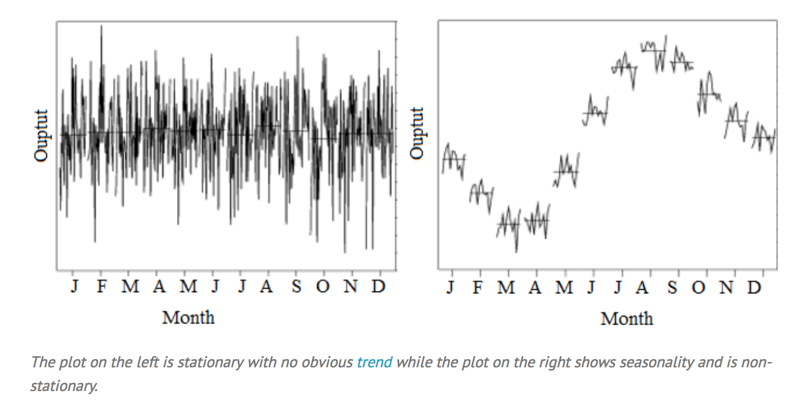

```{r, message=FALSE, warning=FALSE}
library('tidyverse')
library('tidyquant')
library('tseries')
library('gghighlight')
load('api_key.rdata')
```


#### Time series analysis:  

  * Stationary vs. Non-Stationary
  * Additive vs. Exponential
  * ARMA / ARIMA models
  * Filters: Kalman, Holt-Winters
  * Stochastic Processes, Random Walk, Wiener Process, Brownian Motion
  

#### What is a stationary time series?

"A time series is stationary if a shift in time doesn't cause a change in the shape of the distribution. Basic properties of the distribution like the mean, variance, and covariance are constant over time."




#### Different types of stationarity:  

  * Strict Stationarity - basically doesn't exist... essentially nothing changes based off of time...
  * First-Order Stationarity - means never change, but other statistics can change
  * Second-Order (Weak) Stationarity - constant mean, variance, and autocovariance that doesn't change with time 
  * Trend-Stationary Models - fluctuate around deterministic trend (series mean). Trend is typically linear or quadratic, amplitude of fluctuations stays constant
  * Difference-Stationary Models - one or more differences of the data need to be taken to make it stationary


#### Why do we care about stationarity?  

Most statistical models that have been developed assume stationarity.


  
```{r, warning=FALSE}
set.seed(100)

# monthly data, normally distributed
# 100 stoltzcoin average trade price per month
# Standard deviation of 3
dates = seq(from = lubridate::ymd('2011-07-01'), 
            to = lubridate::ymd('2018-06-30'), 
            by = 'months')

n = length(dates)
mu = 100
sd = 3

time_series = tibble(date = dates, stoltzcoin = rnorm(n = n, mean = mu, sd = sd), 
                     type = 'stationary', trend = 'none')

ggplot(time_series, aes(x = date, y = stoltzcoin)) + 
  geom_line() + geom_smooth(method = lm, 
                            formula = y ~ x, se = FALSE) + 
  geom_hline(aes(yintercept = mean(stoltzcoin)), color="red")
```


#### Perform regression and look at the residuals

```{r}
ts_fit = lm(stoltzcoin ~ date, data = time_series)
ts_fit
```


```{r}
res = tibble(residuals = resid(ts_fit))
ggplot(res, aes(x = 1:nrow(res), y = residuals)) + geom_point() + geom_rug(sides = 'l')
```

```{r}
ggplot(res, aes(x = residuals)) + geom_histogram(aes(y = ..density..), bins = 40) + geom_density(col = 'red', size = 1.5)
```


## Always test for stationarity even if it looks stationary
##### Augmented Dickey-Fuller is a typical test - tseries::adf.test()
  * Tests null hypothesis that the autoregressive model has a unit root
  * Stationarity means rejecting the null hypothesis
  * We will look for p-value < 0.05


```{r}
# adf.test only accepts univariate time series data, zoo object will be used
adf.test(zoo::zoo(time_series$stoltzcoin, time_series$date))

```


### Add a linear trend for the example
#### Stoltzcoin has been going up by 2 each month
#### Known as "trend stationary"

```{r}
going_up_by = 2
trend = seq(from = 0, 
            to = (n-1) * going_up_by,
            by = going_up_by)

ts_lin_trend = tibble(date = dates, stoltzcoin = time_series$stoltzcoin + trend, 
                     type = 'non-stationary', trend = 'linear')

ggplot(ts_lin_trend, aes(x = date, y = stoltzcoin)) + 
  geom_line() + geom_smooth(method = lm, 
                            formula = y ~ x, se = FALSE) + 
  geom_hline(aes(yintercept = mean(stoltzcoin)), color="red")
```


#### Perform regression and look at the residuals

```{r}
ts_fit = lm(stoltzcoin ~ date, data = ts_lin_trend)
ts_fit
```


```{r}
res = tibble(residuals = resid(ts_fit))
ggplot(res, aes(x = 1:nrow(res), y = residuals)) + geom_point() + geom_rug(sides = 'l')
```

```{r}
ggplot(res, aes(x = residuals)) + geom_histogram(aes(y = ..density..), bins = 40) + geom_density(col = 'red', size = 1.5)
```


```{r}
adf.test(zoo::zoo(ts_lin_trend$stoltzcoin, ts_lin_trend$date))
```


### Add a seasonal component to the linear trend
#### Stoltzcoin fluctuates throughout the year

```{r}
going_up_by = 2
trend = seq(from = 0, 
            to = (n-1) * going_up_by,
            by = going_up_by)
seasonal = sin(1:n) * 10

ts_lin_trend_seasonal = tibble(date = dates, stoltzcoin = time_series$stoltzcoin + trend + seasonal, 
                     type = 'non-stationary', trend = 'linear')

ggplot(ts_lin_trend_seasonal, aes(x = date, y = stoltzcoin)) + 
  geom_line() + geom_smooth(method = lm, 
                            formula = y ~ x, se = FALSE) + 
  geom_hline(aes(yintercept = mean(stoltzcoin)), color="red")
```


#### Perform regression and look at the residuals

```{r}
ts_fit = lm(stoltzcoin ~ date, data = ts_lin_trend_seasonal)
ts_fit
```


```{r}
res = tibble(residuals = resid(ts_fit))
ggplot(res, aes(x = 1:nrow(res), y = residuals)) + geom_point() + geom_rug(sides = 'l')
```

```{r}
ggplot(res, aes(x = residuals)) + geom_histogram(aes(y = ..density..), bins = 40) + geom_density(col = 'red', size = 1.5)
```


```{r}
adf.test(zoo::zoo(ts_lin_trend_seasonal$stoltzcoin, ts_lin_trend_seasonal$date))
```


### Add an exponential trend to the seasonal component
#### Stoltzcoin has increased in volatility over the years
  * Stoltzcoin now has:
    * A positive and growing linear trend
    * Seasonality

```{r}
going_up_by = 2
trend = seq(from = 0, 
            to = (n-1) * going_up_by,
            by = going_up_by)
seasonal = sin(1:n) * 1:n

ts_lin_trend_seasonal_exp = tibble(date = dates, stoltzcoin = time_series$stoltzcoin + trend + seasonal, 
                     type = 'non-stationary', trend = 'linear')

ggplot(ts_lin_trend_seasonal_exp, aes(x = date, y = stoltzcoin)) + 
  geom_line() + geom_smooth(method = lm, 
                            formula = y ~ x, se = FALSE) + 
  geom_hline(aes(yintercept = mean(stoltzcoin)), color="red")
```


#### Perform regression and look at the residuals

```{r}
ts_fit = lm(stoltzcoin ~ date, data = ts_lin_trend_seasonal_exp)
ts_fit
```


```{r}
res = tibble(residuals = resid(ts_fit))
ggplot(res, aes(x = 1:nrow(res), y = residuals)) + geom_point() + geom_rug(sides = 'l')
```

```{r}
ggplot(res, aes(x = residuals)) + geom_histogram(aes(y = ..density..), bins = 40) + geom_density(col = 'red', size = 1.5)
```


```{r}
adf.test(zoo::zoo(ts_lin_trend_seasonal_exp$stoltzcoin, ts_lin_trend_seasonal_exp$date))
```


## R's decompose function does a lot for you
```{r}
d1y =  as.numeric(lubridate::year(min(ts_lin_trend_seasonal_exp$date)))
d1m = as.numeric(lubridate::month(min(ts_lin_trend_seasonal_exp$date)))
d2y =  as.numeric(lubridate::year(max(ts_lin_trend_seasonal_exp$date)))
d2m = as.numeric(lubridate::month(max(ts_lin_trend_seasonal_exp$date)))

x = ts(ts_lin_trend_seasonal_exp$stoltzcoin, start=c(d1y, d1m), end=c(d2y, d2m), frequency=12)

plot(decompose(x, type = 'additive'))

```


```{r}
plot(decompose(x, type = 'multiplicative'))
```


### Example from decompose function
#### random portion should just look like white noise (otherwise you've likely missed something)
```{r}
require(graphics)

m <- decompose(co2)
plot(m)
```


```{r, warning=FALSE, message=FALSE}
dow = tq_index("DOW") %>%
  tq_get(get = "stock.prices")
head(dow, 10)
```


```{r warning=FALSE, message=FALSE}
p = ggplot(dow, aes(x = date, y = close, col = symbol)) + 
  geom_line() + 
  gghighlight(max(close) > 250) + 
  theme_minimal() + 
  facet_wrap(~ symbol)
print(p)
```


## Is BA a stationary time series?

#### Can you simply zoom in and find a portion that is stationary?
```{r}
ba = dow %>% 
  filter(symbol == 'BA') %>% 
  select(date, close)
plotly::ggplotly(ggplot(ba, aes(x = date, y = close)) + geom_line() + geom_smooth(method = lm, se = FALSE))
```


```{r}
adf.test(zoo::zoo(ba$close, ba$date))
```


```{r}
ts_fit = lm(close ~ date, data = ba)
ts_fit
```


```{r}
res = tibble(residuals = resid(ts_fit))
ggplot(res, aes(x = 1:nrow(res), y = residuals)) + geom_point() + geom_rug(sides = 'l')
```

```{r}
ggplot(res, aes(x = residuals)) + geom_histogram(aes(y = ..density..), bins = 40) + geom_density(col = 'red', size = 1.5)
```


#### Are the daily returns stationary?

```{r}
ret = ba %>%
  tq_transmute(close, mutate_fun = dailyReturn)
ggplot(ret, aes(x = date, y = daily.returns)) + geom_line() + geom_smooth(method = lm, se = FALSE)
```


```{r}
adf.test(zoo::zoo(ret$daily.returns, ret$date))
```


```{r}
ts_fit = lm(daily.returns ~ date, data = ret)
ts_fit
```


```{r}
res = tibble(residuals = resid(ts_fit))
ggplot(res, aes(x = 1:nrow(res), y = residuals)) + geom_point() + geom_rug(sides = 'l')
```

```{r}
ggplot(res, aes(x = residuals)) + geom_histogram(aes(y = ..density..), bins = 40) + geom_density(col = 'red', size = 1.5)
```


```{r}

```

